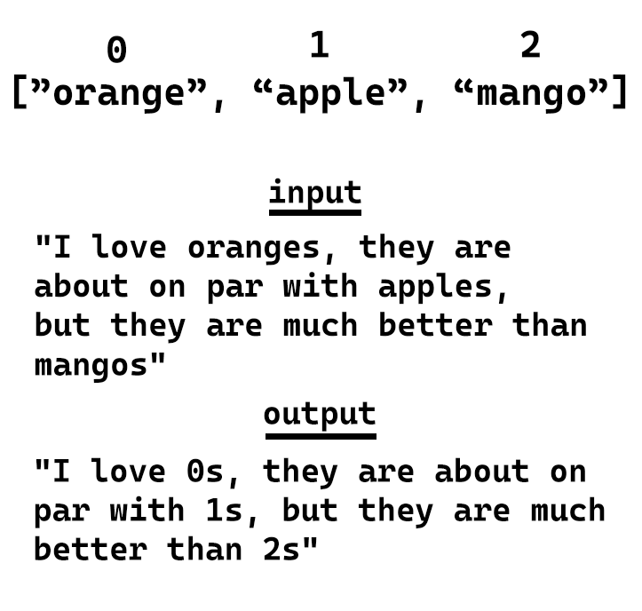
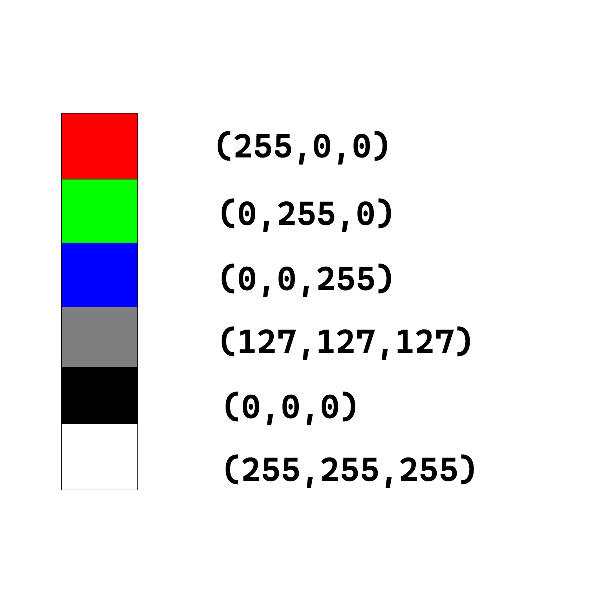
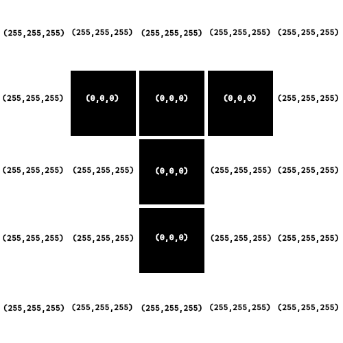
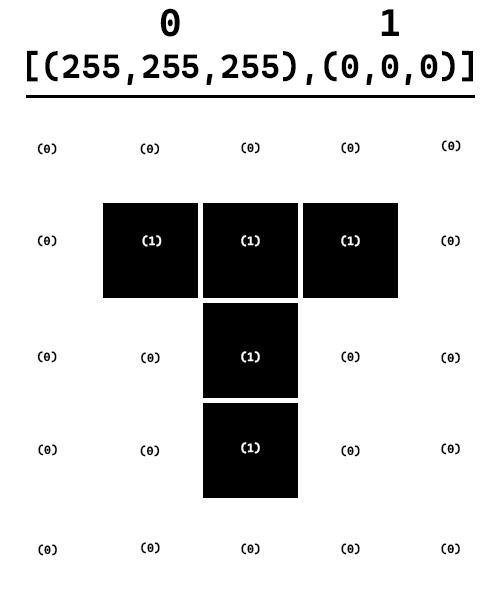

# Compression

This is a helper repository to the blog post on https://schulichignite.com/blog/making-things-small that explains 2 basic compression algorithms, 1 for text, 1 for images.

## Videos

There are several videos created relating to this topic you can find here:

- Walkthrough of the theory (COMING SOON)
- Walkthrough of text version code (COMING SOON)
- Walkthrough of image version code (COMING SOON)

## Running examples

Each file was created in python 3.11, but should work on all versions 3.7+. To run them simply run:

```bash
python <file>.py
```

No additional packages need to be installed to run the examples

## Background knowledge

You should already know:

- How to write and read python well
    - On top of the basics you should also know [comprehensions](https://canadiancoding.ca/Generator%20and%20list%20comprehensions) & [counters](https://canadiancoding.ca/Counters%20Deques%20and%20namedtuples#:~:text=navigate%20the%20post-,Counter%27s,-Counters%20are%20a)
- What [encodings](https://schulichignite.com/definitions/encoding/) are


## Text

For all of our text algorithms we made a few assumptions:

1. Text is in **just english**
2. The text **does not have any numbers**
3. The text is at least a few paragraphs (if it's super short compression is unlikely to be helpful)
4. Each character takes up 1 byte (i.e. "a" is 1 byte); This is just important when calculating efficiency

All of the text compression algorithms work off the basic principle of creating a mapping between words and indicies in lists. Here is an example:



The output in this example has been compressed by 13 bytes. For our algorithms we have 3 common steps:

1. Establish a set of words in a list that will be used to map words to indicies
2. Cleanup and sort the list in some form to make it as efficient as possible
3. Loop over the list of words and replace each occurance of a word in the input text with it's index in the list

In `text.py` there are 3 versions of the algorithm in 3 functions:

1. `compress_by_common_words()`; Uses the 100 most common english words capitalized and lowercase
2. `compress_by_common_words_improved()`; Uses the same method as 1, but with a few improvements to the filtering and sorting
3. `compress_with_counter()`; Generates the wordlist by looking at the words in the text and choosing the most frequent ones

## Images

The image algorithm does not use real images. It uses a custom encoding to represent images. The encoding relies on RGB tuples, where there are 3 numbers between 0-255, each number represents the "amount" of the colour to use. For example (255,0,0) means use "%100 red and 0% green and 0% blue". Here is a chart to help visualize this:



For our code we will use an encoding of lists of "rows" of pixels, with each pixel being a list. So this list:

```python
image_values = [ 
    # Start with third dimension being a list so the values can be rounded (tuples are immutable)
    [[255,255,255],[255,255,255],[255,255,255],[255,255,255],[255,255,255]],
    [[255,255,255],      [0,0,0],[0,0,0],[0,0,0],      [255,255,255]],
    [[255,255,255],[255,255,255],[0,0,0],[255,255,255],[255,255,255]],
    [[255,255,255],[255,255,255],[0,0,0],[255,255,255],[255,255,255]],
    [[255,255,255],[255,255,255],[0,0,0],[255,255,255],[255,255,255]],
]
```

Corresponds to this 5 by 5 image:


Something like this:



From this we do the same principles as the text algorithms, except with the list of lists of lists (which we convert to a list of list of tuples, because lists can't be put as keys of dictionaries), and we get a process that starts like this:


and then once the actual compression has been complete we end up with:


